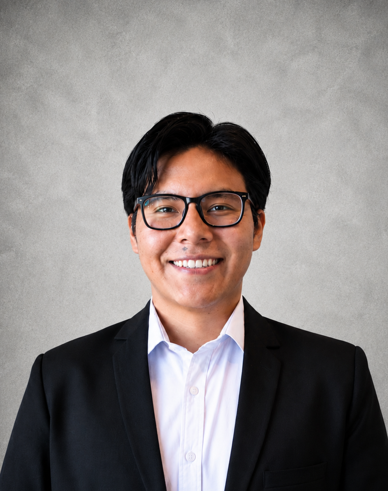
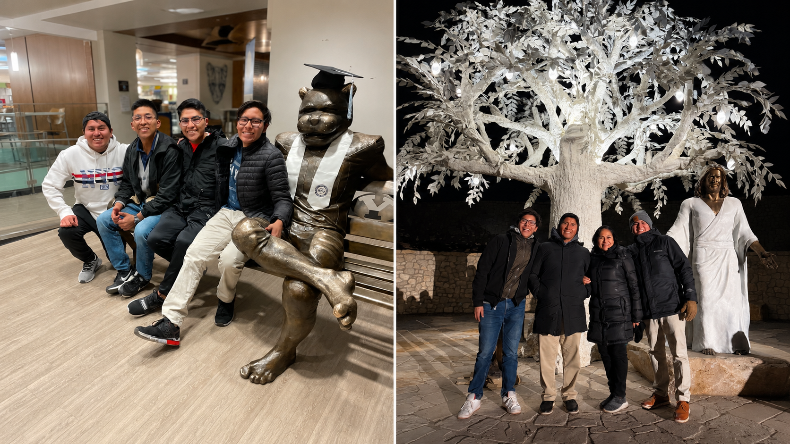
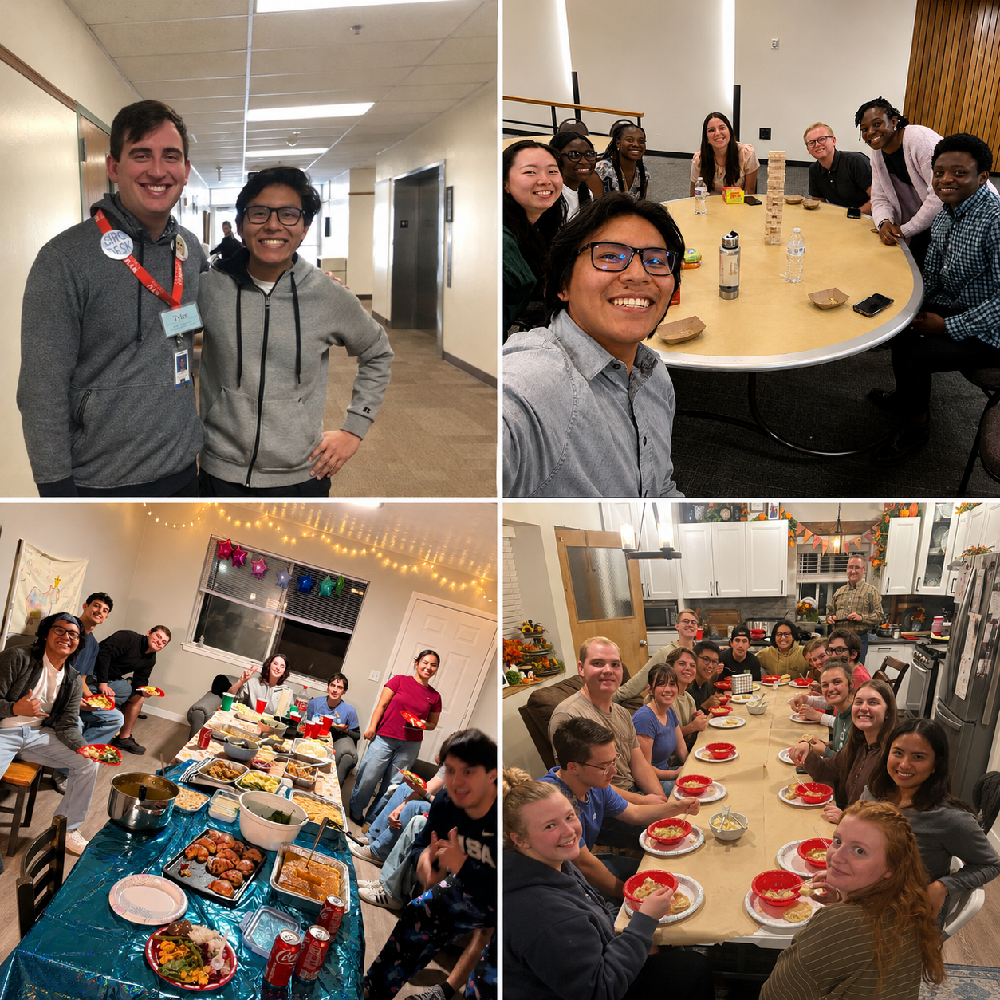
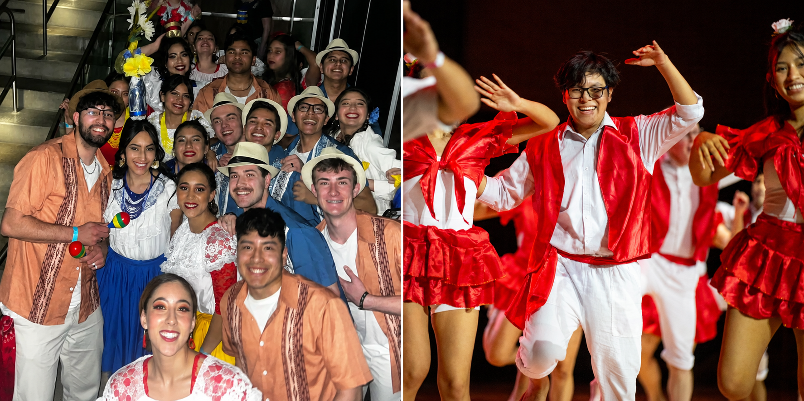
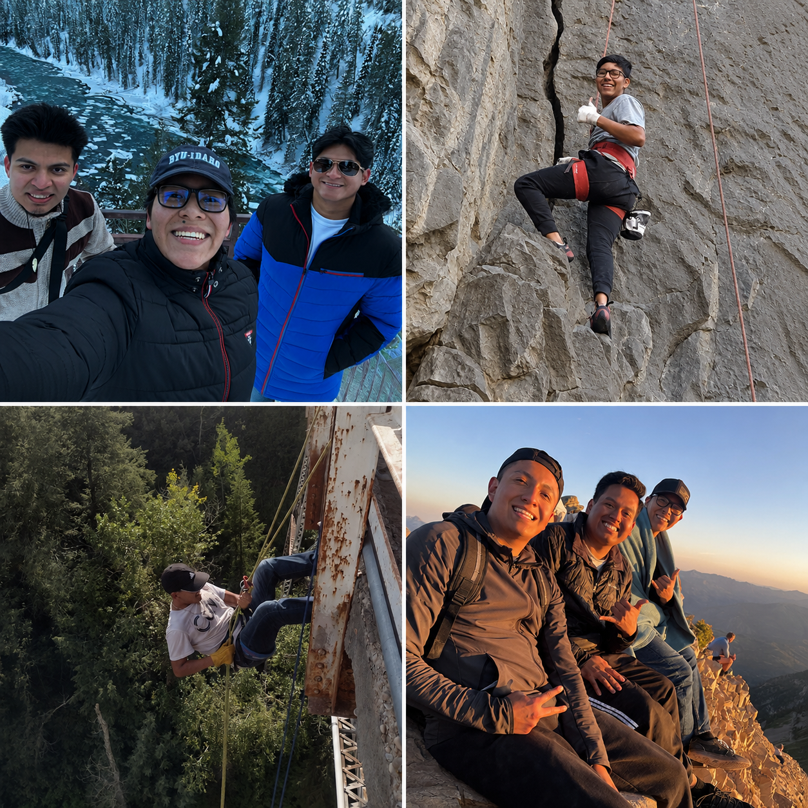
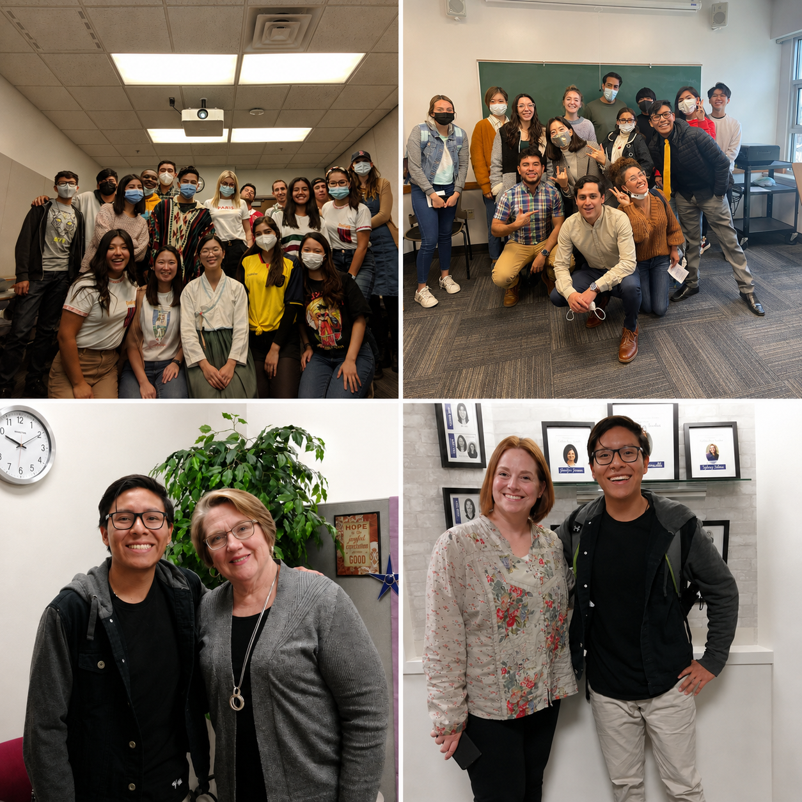

## Diego Chuquimia \| Economist Major

#### MINOR IN DATA SCIENCE & BUSINESS ANALYTICS

------------------------------------------------------------------------
::::: columns
::: {.column width="50%" style="vertical-align: middle;"}
{width="80%"}

:::

::: {.column width="45%" style="vertical-align: middle; padding-left: 5%;"}
I am Diego Andres Chuquimia, an international student from Bolivia whose dream was to learn as much possible regarding how the business world works in the market, what makes them successful, and which companies have potential of growth. 

This question made me become **an Economics student**, who is passionate about leveraging data science, analytics, and data tools to uncover market insights and solve financial and economic problems.
:::
:::::

::: panel-tabset

### Professional & Personal Interests

I am particularly interested in financial analytics, forecasting, and business intelligence. I enjoy working at the intersection of economics, finance, and data, where analytically thinking and technology are combined to solve business challenges.

In addition to my technical expertise, I can speak in Spanish, English, and Portuguese, enabling me to collaborate effectively in multicultural and international environments. I am seeking opportunities where I can contribute through data-driven decision-making while continuing to grow as an Analyst.

Beyond my professional interests, the following highlights some of the experiences, values, and interests that have shaped who I am.:

| **Category**                          | **Details**                                                                                                                                                           |
| ------------------------------------- | --------------------------------------------------------------------------------------------------------------------------------------------------------------------- |
| **Languages**                         | Spanish (Native) • English (Professional Proficiency) • Portuguese (Intermediate)                                                                                     |
| **Learning & Cultural Interests**     | Language learning, world cultures, travel, modern history, humanities, Spanish literature, entrepreneurial history, biographies, cultural traditions, and folk music. |
| **Professional Interests**            | Financial markets, labor economics, treasury operations, market research, business intelligence, data visualization, forecasting, and analytics.                      |
| **Service & Leadership**              | Peer academic mentoring, student support, volunteer service, teamwork, community engagement, and helping others succeed.                                              |
| **Recreation & Wellness**             | Soccer, swimming, hiking, gardening, barbecue grilling, outdoor adventures, country dancing, and meditation.                                                         |

### College Journey

####  Grounded by Faith, Driven by Family

::::: columns
::: {.column width="50%" style="vertical-align: middle;"}

:::

::: {.column width="45%" style="vertical-align: middle; padding-left: 5%;"}

* **Rooted in Gratitude:** Built on a foundation of support from my family and mentors who shaped my journey from day
one.
* **Core Values:** Guided by my faith to practice honesty, kindness, and integrity in every aspect of life.
* **Personal Alignment:** Applying these core principles directly to how I lead, work, and build relationships.

:::
:::::

####  Connecting People, Building Community

::::: columns
::: {.column width="50%" style="vertical-align: middle;"}

:::

::: {.column width="45%" style="vertical-align: middle; padding-left: 5%;"}

* **Team Collaboration:** Worked closely alongside dedicated campus teams to support student success and drive results.
* **Student Leadership:** Served as **Marketing Director for the Economics Society,** expanding student outreach and engagement.
* **Event Organization:** Spearheaded campus events designed to bring peers together, foster networking, and offer mutual support.

:::
:::::

####  Celebrating Heritage, Bridging Cultures

::::: columns
::: {.column width="50%" style="vertical-align: middle;"}

:::

::: {.column width="45%" style="vertical-align: middle; padding-left: 5%;"}

* **Latin Dance Instructor:** Taught Latin dance on campus, sharing my culture while bringing high energy and connection to students.
* **Multicultural Involvement:** Actively participated in cultural organizations that promote inclusion, awareness, and mutual respect.
* **Global Perspective:** Passionate about celebrating diverse backgrounds and creating spaces where everyone feels welcome.

:::
:::::

####  Embracing New Horizons

::::: columns
::: {.column width="50%" style="vertical-align: middle;"}

:::

::: {.column width="45%" style="vertical-align: middle; padding-left: 5%;"}

* **Outdoor Exploration:** Discovered a passion for rock climbing and outdoor activities while adapting to life in Rexburg.
* **Learning Through People:** Strongly believe that true personal growth comes from the unique relationships and experiences we share.
* **Well-Rounded Mindset:** Balancing academic and professional goals with health, adventure, and lifelong friendships.

:::
:::::

### ELC Journey

My background blends a **strong work ethic** with **active leadership** and **community engagement.** 

::::: columns
::: {.column width="45%" style="vertical-align: middle; padding-right: 5%;"}

####  Building a Global Mindset

* **International Transition & Adaptability:** Moved to the U.S. after one year of college to complete the English Language Center program, stepping out of my comfort zone to master professional English and adapt to American and International culture.

Student Leadership & Advocacy

* **Class Representative:** Took the initiative to serve as a class representative, acting as a bond between peers and faculty to advocate for student needs and build a collaborative academic environment.

Peer Mentorship & Volunteer Service

* **Study Buddy Volunteer:** Actively engaged in academics while support Native American students to master Spanish while also creating groups for international study sessions.

:::

::: {.column width="50%" style="vertical-align: middle;"}
{weight="150%"}
:::
:::::

:::
