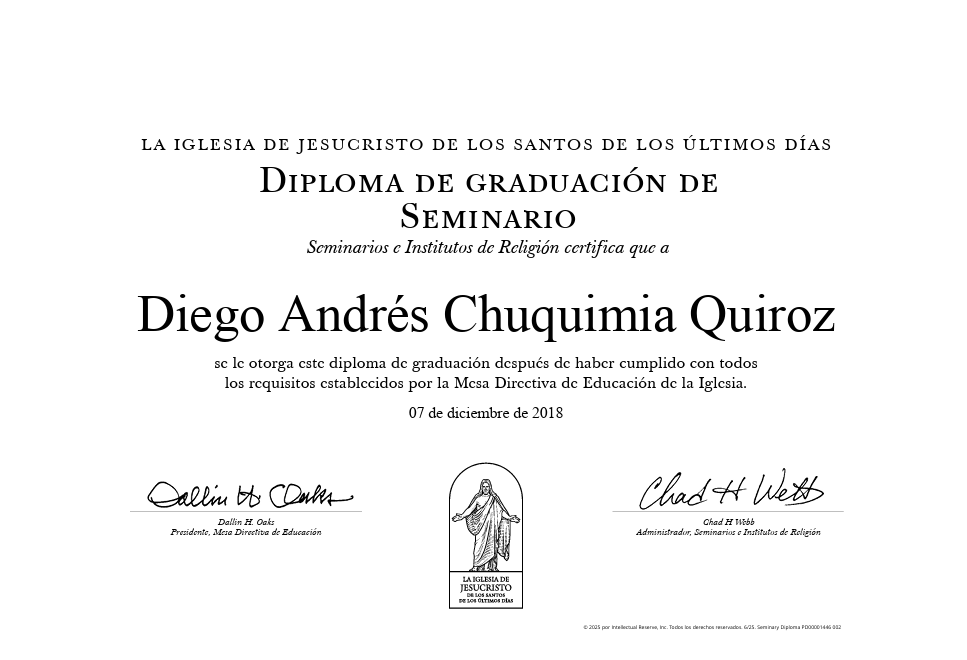
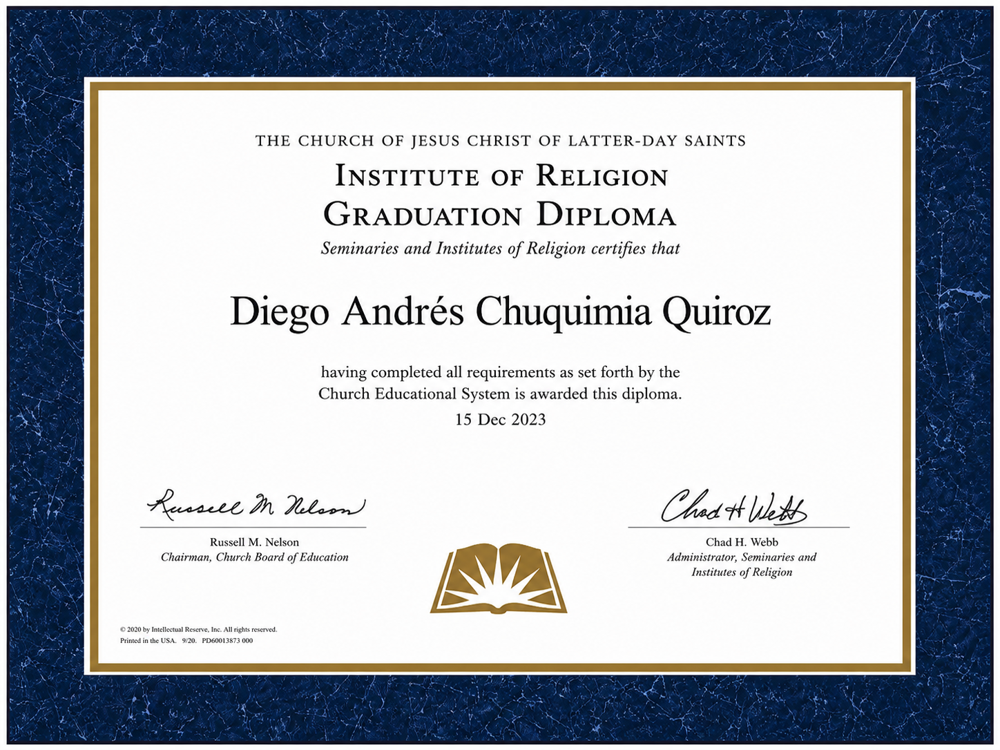
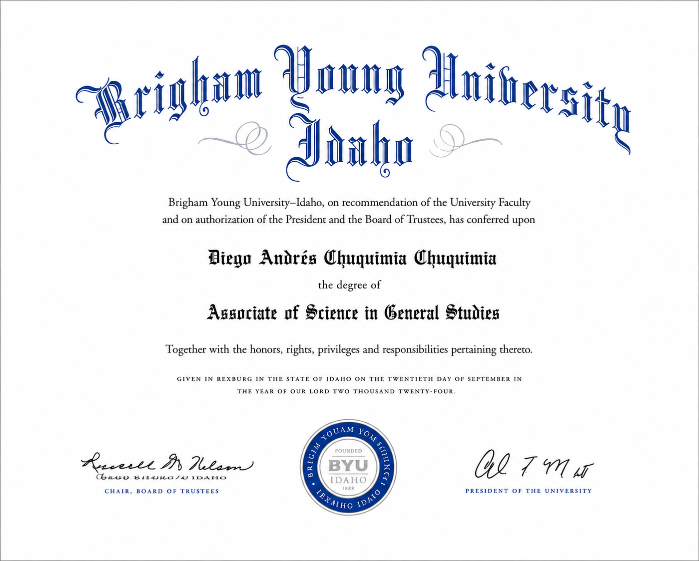
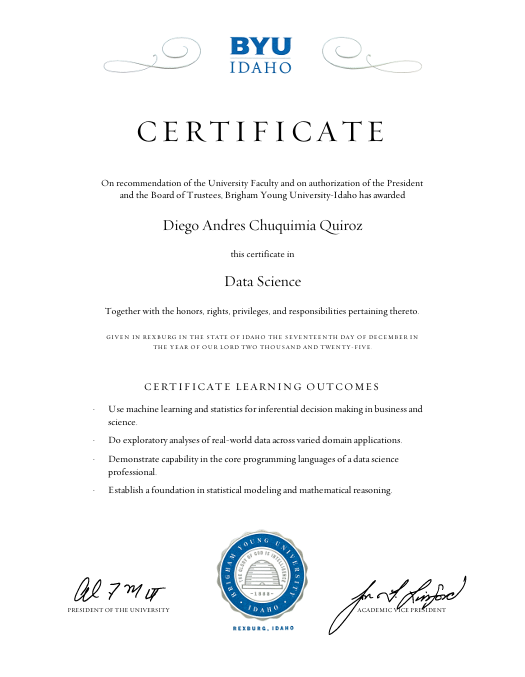
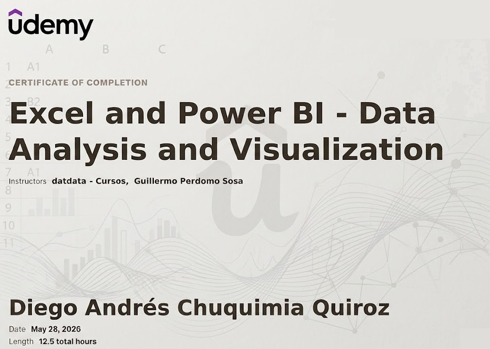
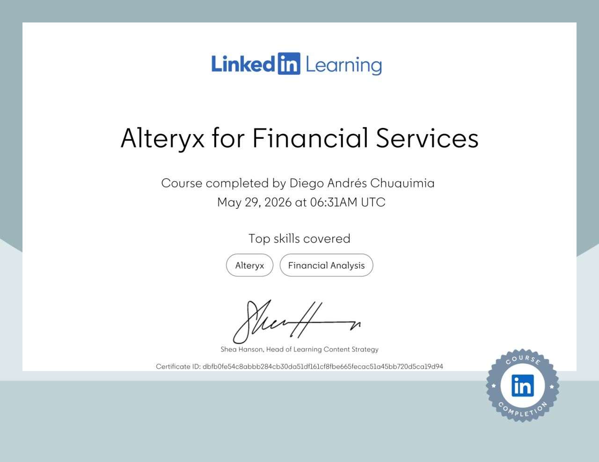
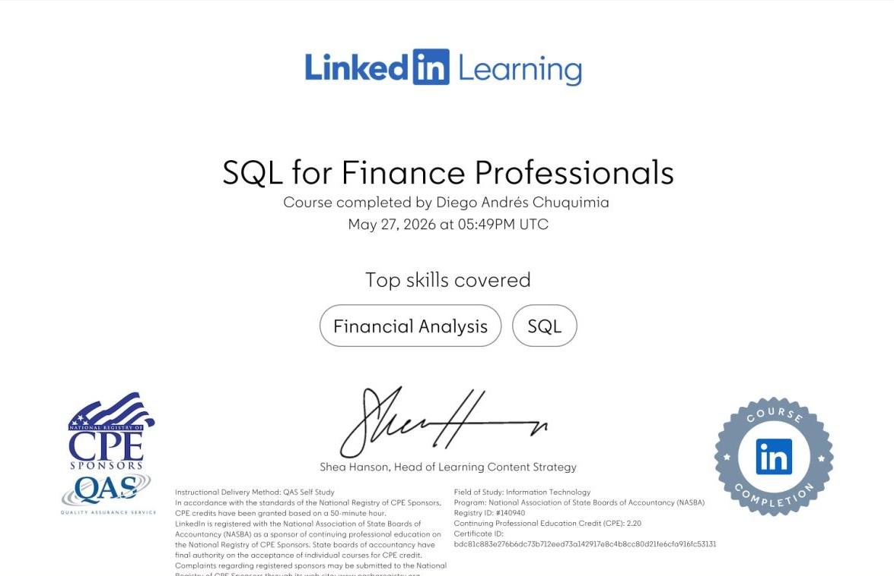
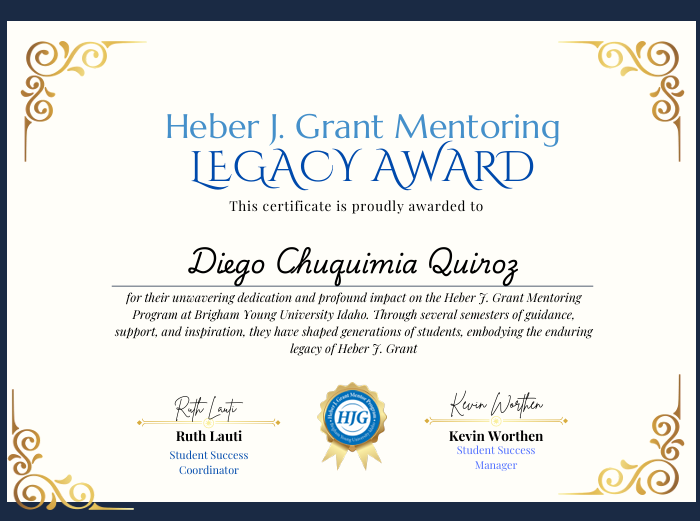
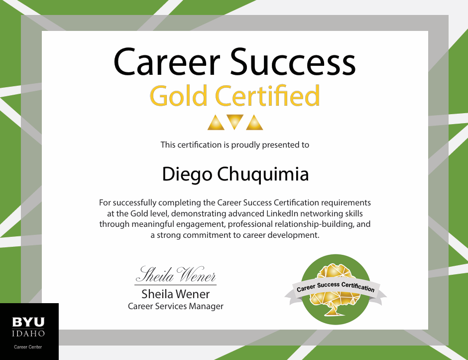

### LDS Church Certifications

* **Seminary Certificate**

{width="50%"}

* **Institute Certificate**

{width="50%"}

### Academic Degrees

* **Asociate's Degree in General Studies**

{width="50%"}

* **Bachelor's Degree Economics (In-Progress 2027)**

### Business Intelligence & Analytics

* **Data Science (SQL, Tableu, Python, Power BI, Excel, and R)**

{width="50%"}

* **Excel & Power BI: Data Analysis and Visualization**

{width="50%"}

* **Intermediate SQL: Data Reporting and Analysis (In-Progress 2026)**

* **Power Automate Essential Training**

{width="50%"} 

### Finance

* **Alteryx for Financial Services**

{width="50%"}

* **SQL for Finance Professionals**

{width="50%"}

* **CFI Financial Analysis and Modeling Professional Certificate (In-Progress 2026)**

* **Excel for Finance: Building a Three-Statement Operating Model (In-Progress 2026)**

* **Financial Mathematics (In-Progress 2027)**

### Leadership & Personal Development

* **Heber J. Grant Mentoring**

{width="50%"}

* **Career Success - Gold Certificate**

{width="50%"}

