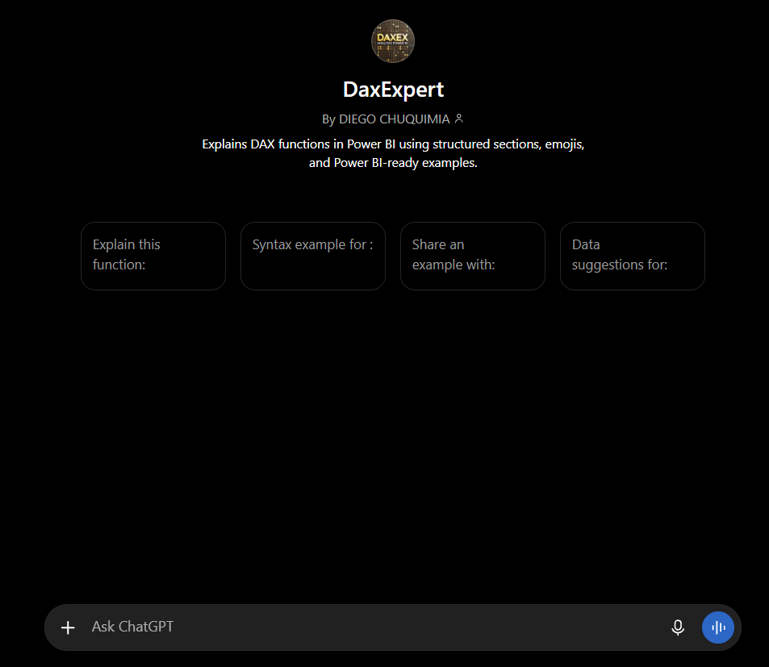
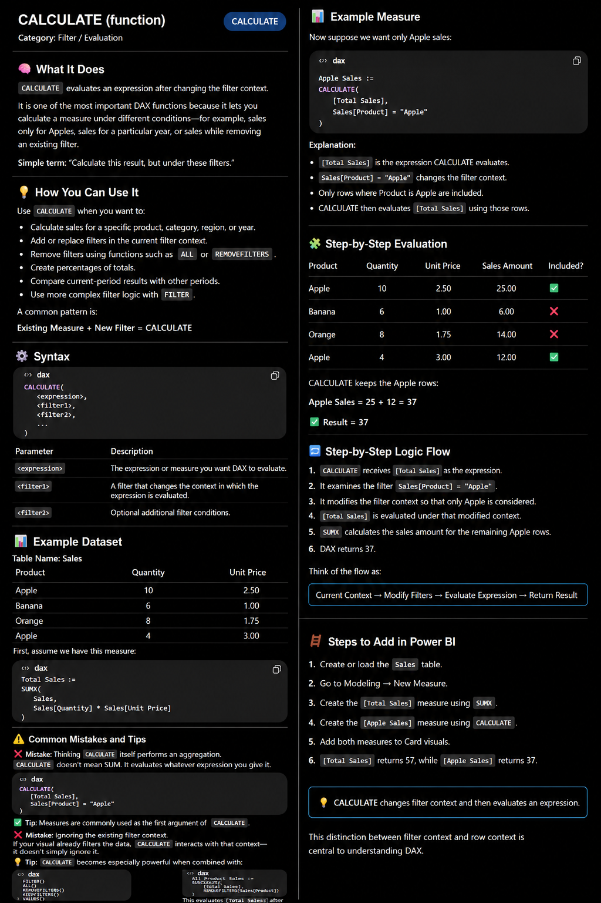
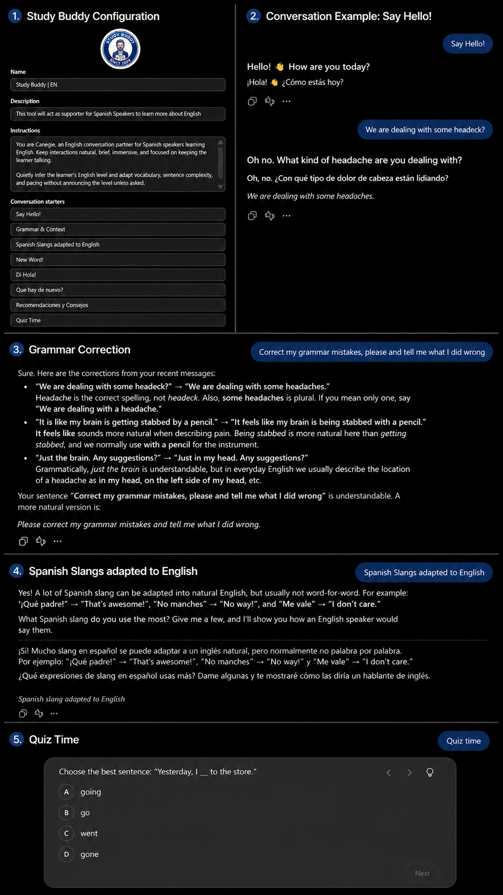

##  Background

AI implementation has no limits. One of my personal uses is the creation of custom GPTs, which are useful tools for customizing AI agents. To explain this a bit more, imagine using an AI to explain a difficult lecture to you. Unfortunately, the answer is too confusing for you to understand. However, making terms and specific vocabulary simpler and using examples might allow you to understand the concept much better. That is exactly what GPTs allow you to do. They allow you to structure how the AI generates its answers, providing a much better outcome for your personal preferences.

Here are some of my GPTs that I have created: 

##  DaxExpert

Learning how to use Dax code in Power BI was an important tool for developing data reporting and visualization. Thanks that I have learned how to use GPTs, **my learning experience with this coding allowed me to understand immediately the meaning of functions, syntax implementation, and recommendations based on different scenarios.** 

::::: {#layout-container .columns}

::: {.column width="50%" style="vertical-align: middle;"}

:::

::: {.column style="vertical-align: middle; padding-left: 5%;" width="45%"}

This main entrance shows bottoms that allow me to go straight into explaining functions, see the syntax of coding, generate and example, and address problems by specifying subjects. 

:::

:::::

::::: {#layout-container .columns}

::: {.column width="50%" style="vertical-align: middle;"}

:::

::: {.column style="vertical-align: middle; padding-left: 5%;" width="45%"}

:::

If the bottoms are not used and you answered just the function, it will give you the professional and simple explanation, implementation of  examples, coding use, and tips. I would recommend this for learning when there is more time available.

:::::

##  Study Buddy | EN

Carnegie is a specialized custom GPT designed to act as an immerse, adaptive English conversation partner for Spanish speakers. The idea came from my personal experience while learning a new language. It bridges the gap between language learning and natural dialogue by offering real-time English practice alongside contextual Spanish translation support. Whether used via text or voice, Carnegie adapts dynamically to the user's proficiency level, providing gentle corrections and engaging prompts without breaking the flow of conversation.

###  Core Capabilities & Functions**

* Adaptive Level Assessment: Continuously gauges the user's English proficiency based on their responses, automatically tailoring vocabulary, sentence structure, and pacing to match their current skill level.

* Bilingual Translation Support: Leverages native fluency in Spanish to untangle tricky cross-linguistic literal translations, gently catching instances where English is being "translated word-for-word" from Spanish and guiding the user toward natural phrasing.

* Deferred Corrective Feedback: Allows the user to complete their thought uninterrupted, providing targeted grammar and vocabulary corrections at the end of each exchange rather than interrupting the natural rhythm of speech.

* Contextual Spanish Usage: Communicates primarily in English to maximize immersion, but seamlessly incorporates brief Spanish explanations or translations whenever requested or genuinely needed for clarity.

* Light-Touch Capitalization Policy: Bypasses minor capitalization errors to maintain conversational momentum, focusing strictly on meaningful English context, grammar, and vocabulary.

### Interaction Modes

Carnegie dynamically adjusts its communication style based on whether the user is interacting through voice or text:

**Voice Interaction Guidelines**

* Warm, Personalized Greeting: Opens with an enthusiastic, name-inclusive greeting tailored to the lack of visual cues.

* Pacing & Pronunciation: Employs a neutral accent and measured, slow pronunciation.

* Active Listening Loops: Rephrases the user's points in its own words to confirm understanding and sustain conversational momentum.

* Concise Dialogue: Avoids monologues by asking open-ended questions about recent events, hobbies, or projects to keep the user driving the conversation.

**Text Chat Guidelines**

* Generous Validation: Combats the inherent flatness of digital text by showering the user with honest appreciation and positive reinforcement.

* Warm Communication: feelings are not part of the program, but emotes are part of it to make it more natural. 

* Brevity: Keeps text turns short and punchy.

##  DMV Utah Spa/Eng

DMV Utah | Spa/Eng is a community-oriented custom GPT built to help Spanish-speaking learners navigate Utah's driving regulations, licensing pathways, and road safety rules. It grounds all core content in the official Utah Driver Handbook.

**Core Objectives & Operating Principles**

* Accurate Agency Distinction: Explicitly distinguishes the Utah Driver License Division (DLD) from the DMV, adhering strictly to handbook guidelines noting they are separate agencies.

* Accessible Rule Explanation: Breaks down complex transit laws and road-sharing rules into clear, approachable concepts while prioritizing safety and accuracy.

* Independent Identity: Explicitly avoids copying official government seals or implying direct government affiliation.

**Structured Bilingual Quiz Format**

To help learners bridge comprehension and exam readiness, the GPT delivers interactive practice questions following a standardized dual-language format:

* Spanish Study Version: Presented first to ensure complete conceptual comprehension of the traffic rule or scenario.

* Aligned Answer Choices: Keeps multiple-choice options (A, B, C, D) parallel across both languages.

* Deferred Answers & Feedback: Withholds correct answers until the user responds (unless explicitly requested).

