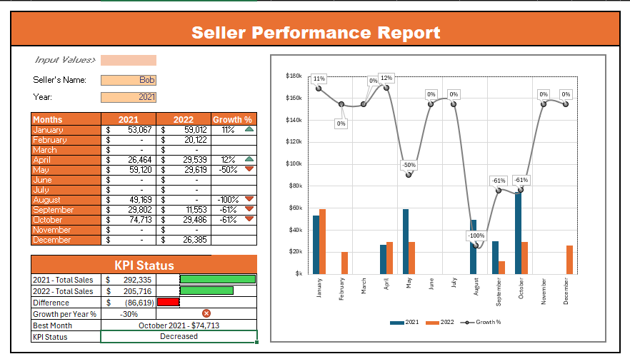
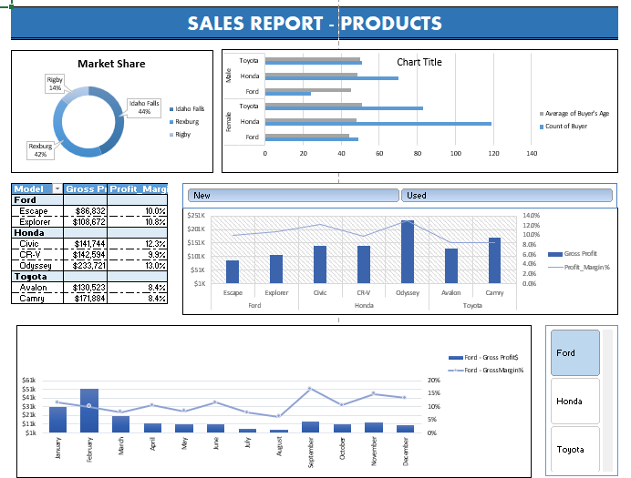
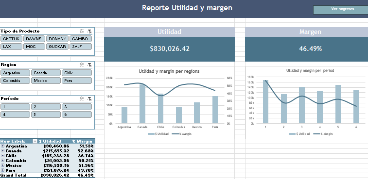
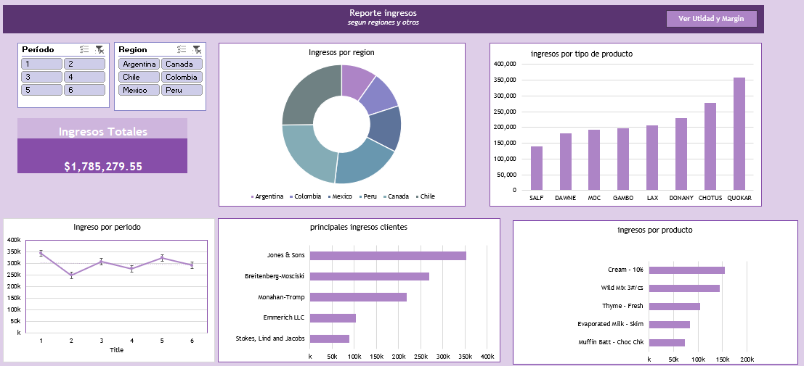
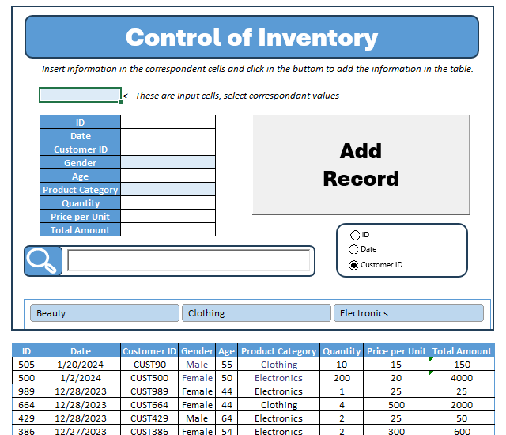
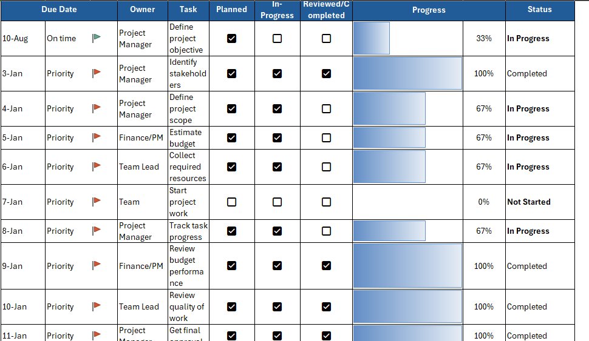
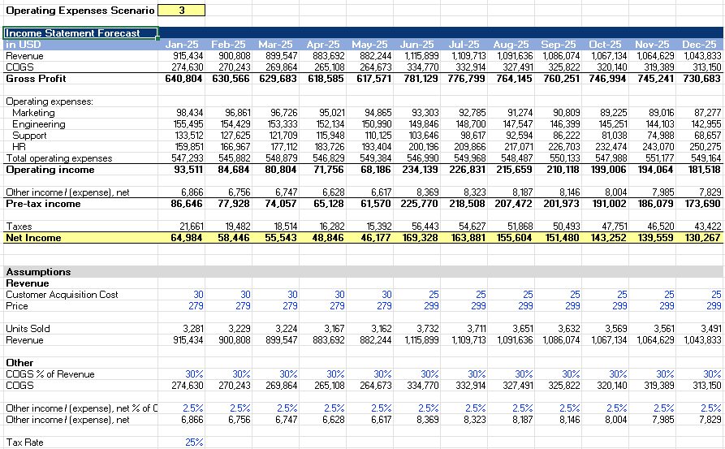
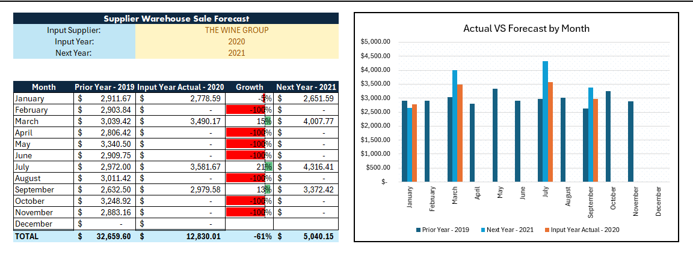

###  SECTION 1: Interactive Dashboards & Business KPIs

####  Executive KPI & Performance Dashboard

::::: columns
::: {.column width="50%" style="vertical-align: middle;"}

:::

::: {.column width="50%" style="vertical-align: middle;"}

* **Goal:** Short sentence on what business question or task this solved.

* **Excel Skillset:** XLOOKUP, INDEX/MATCH, Macros/VBA, PivotTables, Dynamic Charts, Slicers, SUMIFS.

* **Impact:** Brief highlight on business value per suppliers based on their products revenue. Using old data, there is a prediction for the next year.

:::
:::::

#### Sales & Product Analytics Report

####  Income Statement Dashboard

::::: columns
::: {.column width="50%" style="vertical-align: middle;"}

:::

::: {.column width="50%" style="vertical-align: middle;"}

:::
::::::

### SECTION 2: Process Automation & Inventory Control

####  Automated Inventory Management & Form

####  Project Management Task Tracker

### SECTION 3: Financial Modeling

####  Financial Summary & Forecast Model

####  Supplier Warehouse Forecast

