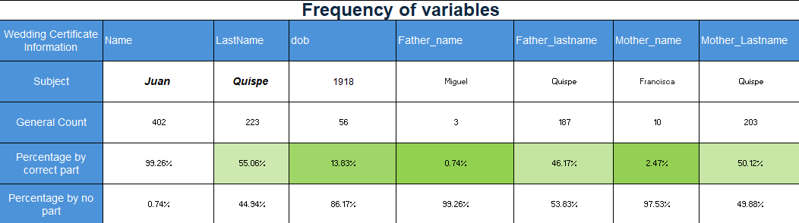
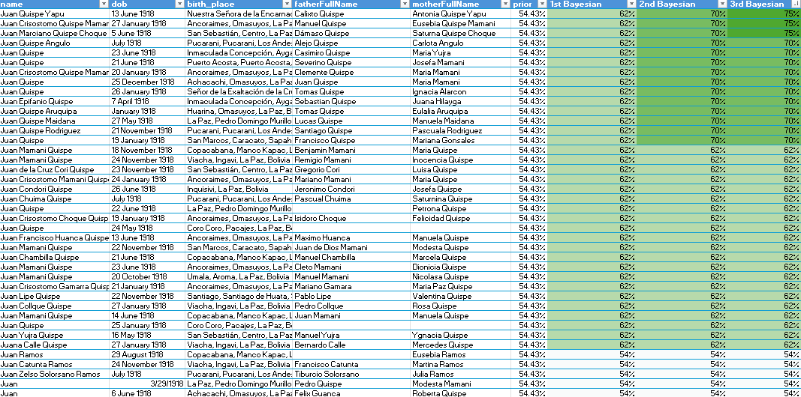
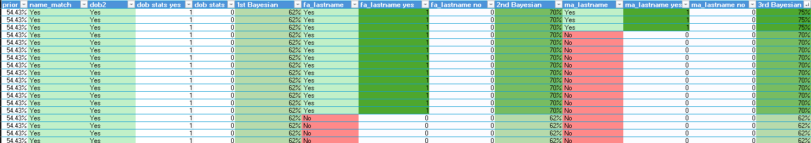
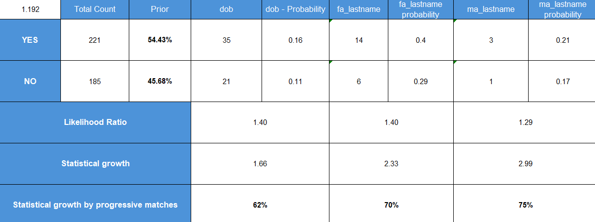

### Background

Family Search provides numerous genealogical sources for structuring family trees, making connections, and compiling comprehensive histories. From this platform, we collect one wedding certificate along with a dataset of proximate individuals from the same location to identify the correct person by matching them as closely as possible to the primary certificate.

For this matching of data, there was two methods that help in this process: 

* **Fellegi-Sunter Method:**  The foundation framework you are building—comparing fields like name, birth date, and parents' surnames to compute weights. ***This method inspired me to determine the relevant variables.***

* **Bayesian Method:** The iterative process of taking a prior probability, applying a piece of evidence to calculate a posterior probability, and then feeding that posterior in as the new prior for the next step. ***This method generates probability growth as variables are sequentially added to match the target document.***

Together, these concepts helped to determinate variables and  increase the chances for being the person of the wedding certificate.

### Analysis of Variables

This table presents the variables incorporated into the statistical growth model: Date Of Birth, Father Last name, and Mother Last name. 

These variables were considered because they serve as a foundational stating point for analyzing the wedding certificate of "Juan Quispe" and understanding the frequency which this variables are occur within the dataset. 

As indicated by the table, it is preferable to use those specific variables that align closely with the main target parameters rather than relying on sparse data points. While small values can make an accurate prediction, this project deals with qualitative and uncontrolled historical sources that have not been rigorously checked. 

The analysis prioritizes variables with enough observations to support meaningful comparisons between the candidate and non-candidates groups.

The Bayesian analysis progressively updates the probability as additional evidence agrees  with the wedding certificates. 

There is statistical growth from 54% to 75% more accuracy in matching results. The initial candidate classification produced a prior probability of approximately 54%. Additional evidence like the date of birth (dob)  increased the posterior probability at 62%. The father's surname provided evidence to reach approximately 70%. The mother's surname allowed the strongest candidate to reach approximately 75% under the assumption of the model. 

Furthermore, the distribution of counts is also reduced by the variable and statistical implementation with the Bayesian method. That is why this project is progressive according the variables and accurate in increasing the probabilities for matching information. 

It does not simply count the number of matching characteristics. Instead, it evaluates how informative each characteristics is relative to its occurrence among candidate and non-candidate records.  

The analysis separates the population into two groups:

* **Candidates:** records satisfying the initial name-based criterion.

* **Non-candidates:** records outside the initial candidate group.

Although the final objective is to identify the strongest candidate, the consideration of candidates or non-candidates connections respect their interaction with the variables. The non-candidates provide a comparison population for estimating how frequently the same evidence could appear by chance among unrelated records.

The "name match" column shows variables that are part of the candidate or non-candidate groups. The other columns that are including the variables with the "yes" and "no" titles are pretty much the count of these variants in their respective groups. This data allows us to evaluate and start with the Bayesian analysis.

To explain quantitatively, here is a table with all the statistical analysis: 

To start with, a prior probability represents the initial proportion of records classified as plausible candidates based on personal perspective. 

The probability is converted into odds, which are then updated using the likelihood ratio associated with each new piece of evidence: 

Prior -> Prior Odds -> Likelihood Ratio -> Posterior Odds -> Posterior Probability

When additional variables or evidence supports the candidate, the posterior probability increases. That posterior then becomes the starting point for evaluating the next variable. 

Finally, last probability is the final  posterior probability. This means that the final result indicates that one record emerged as the strongest potential match to the individual documented in the wedding certificate. However, it should not be interpreted as definitive proof of identity. It is an estimate conditional  on the selected population, variables, available historical information, and assumptions of the model.

### Outcomes & Requirements

The main outcomes of this project is the development of probabilistic record-linkage process that combines data preparation, frequency analysis, likelihood ratios, and sequential Bayesian updating to rank potential historical matches. More importantly, it demonstrates how uncertain evidence can be transformed into a structured decision-making process rather than relying exclusively on subjective judgment.

This statistical mindset can be applied to many other subjects such as fraud detection, credit risk, loan approval, demand forecasting, and sales conversion.

This project required to use critical thinking, background research, great data skills, statistical application, and adaptability to the development of the analysis. 

### Conclusion

This project demonstrates how Bayesian method can transform an uncertain historical-record search into a structured statistical decision process. Starting with a population of possible records, name similarity was used to establish an initial candidate group.

As matching information accumulated, the strongest candidates from an initial probability of approximately 54% to approximately 75%. This candidate therefore represents the strongest potential match identified by the current model, although additional historical evidence would be necessary to confirm the individual's identity.

$$
\text{405 Historical  records } > \text{Candidate screening} > \text{Bayesian evidence} > \text{Strongest Candidates = 3 with 75% match}
$$