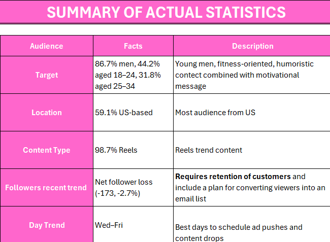
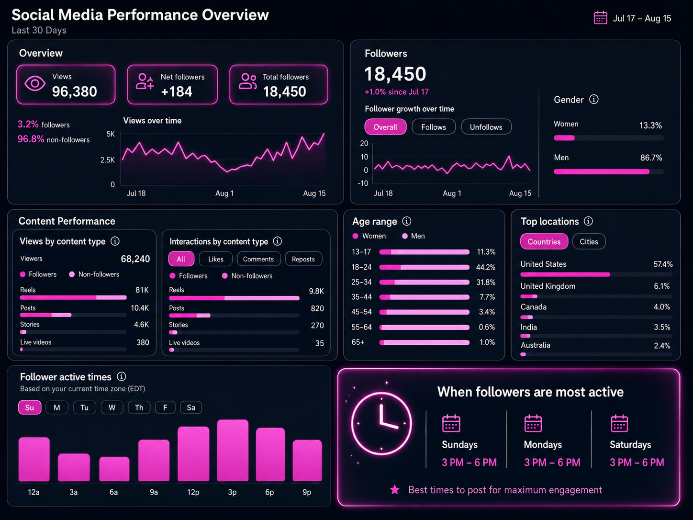
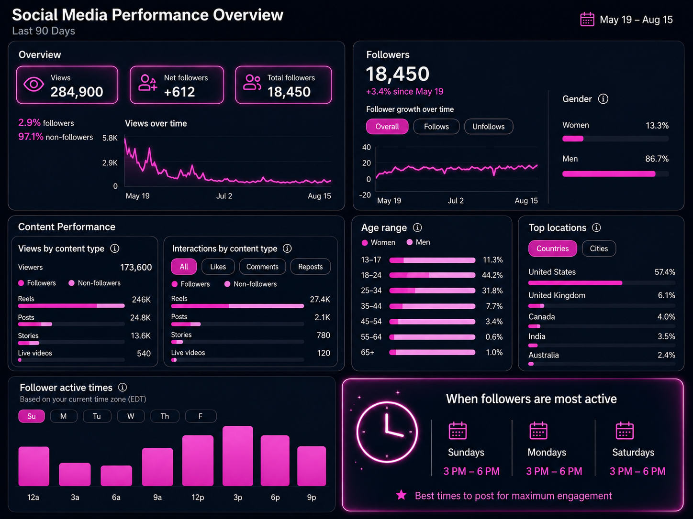
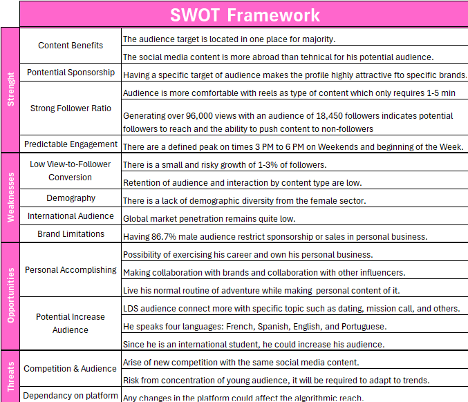
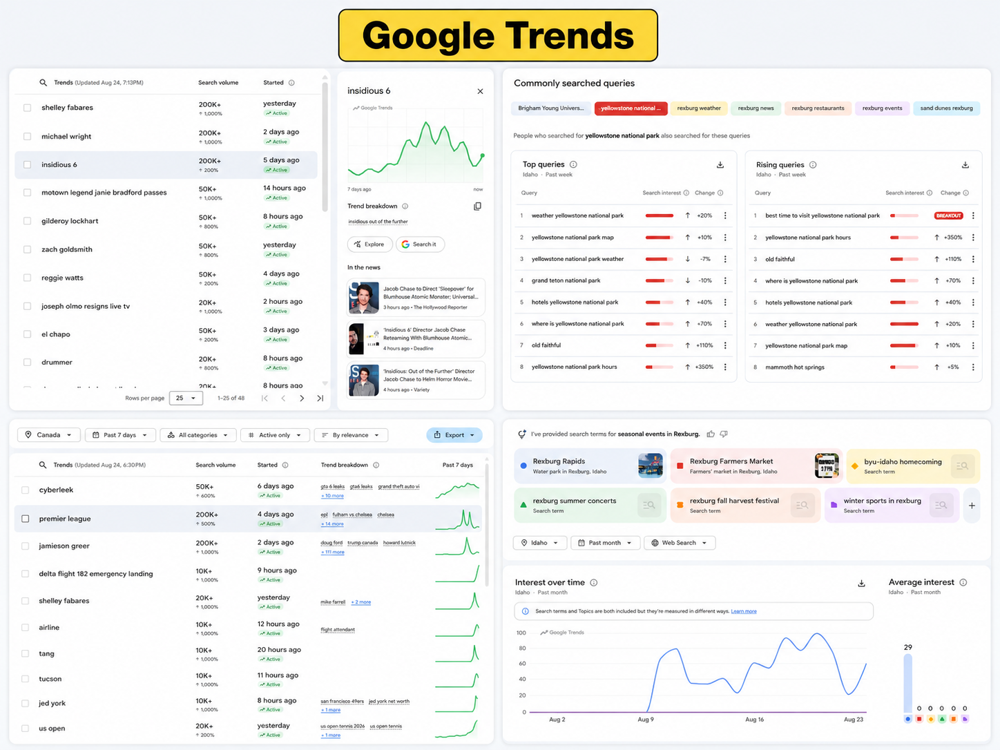

##  Background

An Instagram user started to received many followers through the last year. He got curious of how to make money from his account since his content was well received. From my experience in analysis, I wanted to inspect his case and discuss his personal interests and goals to call on action.

To summarize, his content has a focus on fitness and health with a humorist, motivational, and spiritual connection. Knowing this, he mentioned me that one of his personal interest was to use his account as a hook **to open a business** based on making protein cookies or find a way **to make money by making content**. Here are the options based on his preferences: 

* Selling his personal product. 

* Advertising companies with his account.  

Looking at these cases, both options require increasing their followers, so that would be step 1. The next step is to analyzing both  options and decide the best of them considering the opportunity cost, financial aspects, and project management projection.  

##  Social Media Statistics

::: panel-tabset

### Summary Information

### Data Collected

:::

After looking at the data, I created a SWOT framework to start making a project with consideration all the variables:

This table shows us that there are as much advantages as limitations in developing these projects. To start here, we need to find strategies to increase our audience. 

##  Increasing & retaining audience

One of the main things that I realized is that most of his content was centered to reels, and my suggestion in order to interact with his community was to **use posts and stories**. These ones could be a good space to show himself as another college student with a routine and connect with his audience.

Using Google Trends and Google Analytics, I wanted to look for information that can work with increasing and retaining people on his account. **Using trend tendencies**, I would recommend to address potential audience by adding related content. I am using two places for potential people that are around the Idaho area and Canada.

::::: {#layout-container .columns}

::: {.column width="50%" style="vertical-align: middle;"}

:::

::: {.column style="vertical-align: middle; padding-left: 5%;" width="45%"}

In the left side of this picture, there are more broad or international trends. The one in the top shows what is tendency in overall the United States. For most part, they are about movies which goes to the entertainment content. Something he could do is sharing some stories regarding these movies. It is the same for the Canadian audience which focus more in the league and he could share some of his personal team or recap of the game. 

For the right side, it is more focus on the Idaho area. People at this time are looking at 

:::

:::::