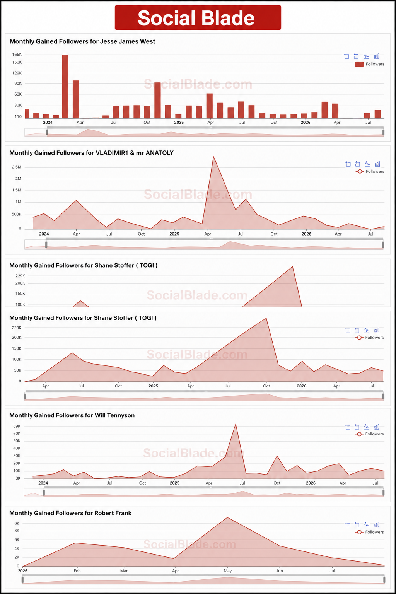
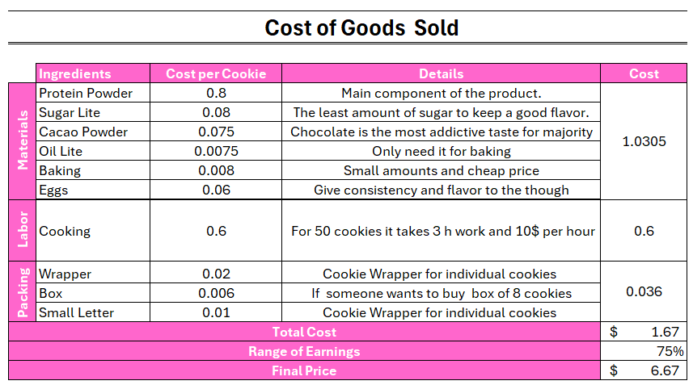
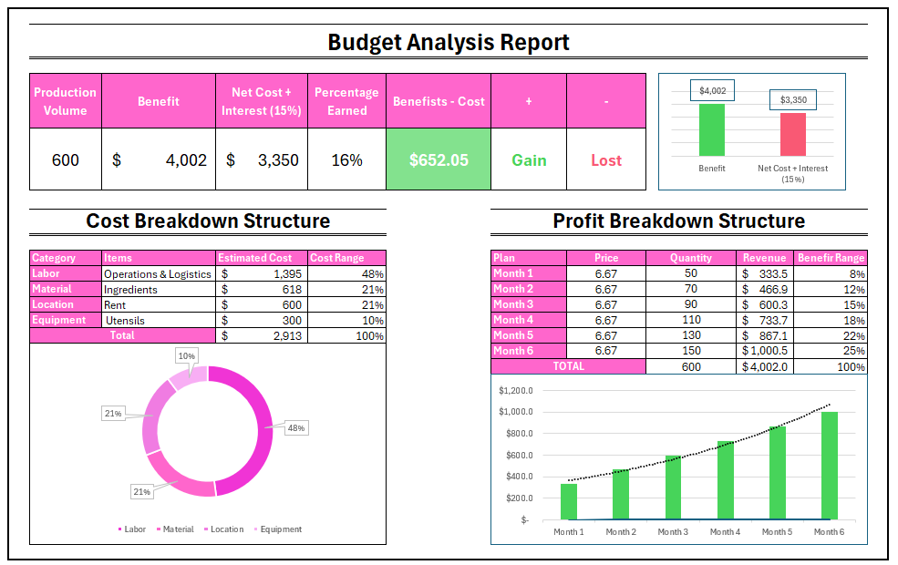
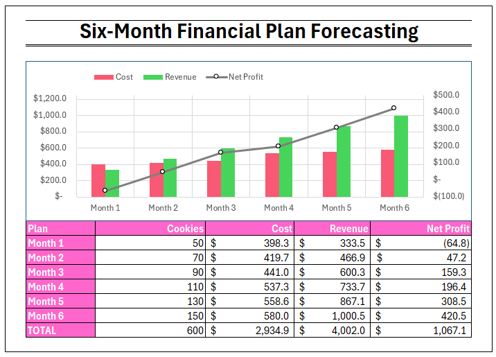
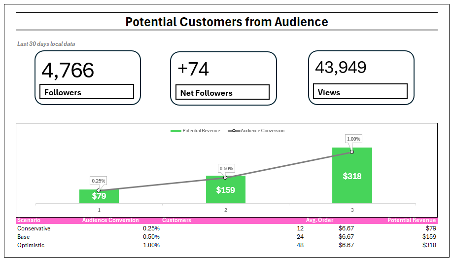
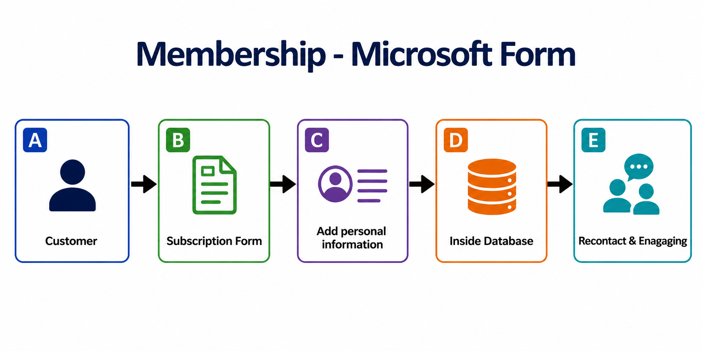
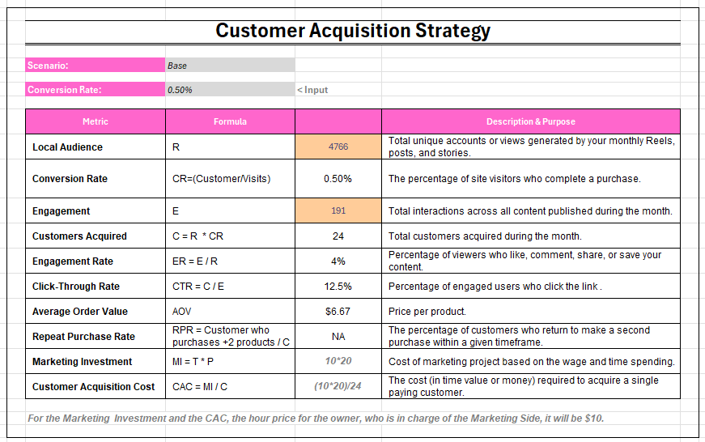
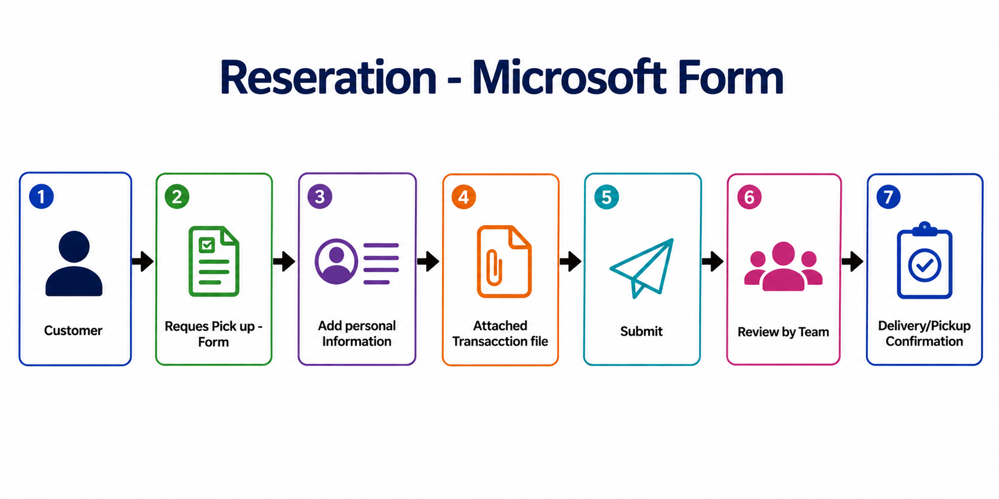
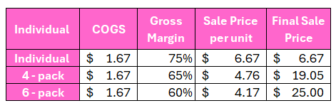

##  Background

An Instagram user started to received many followers through the last year. He got curious of how to make money from his account since his content was well received. From my experience in analysis, I wanted to inspect his case and discuss his personal interests and goals to call on action.

To summarize, his content has a focus on fitness and health with a humorist, motivational, and spiritual connection. Knowing this, he mentioned me that one of his personal interest was to use his account as a hook **to open a business** based on making protein cookies or find a way **to make money by making content**. Here are the options based on his preferences: 

* Selling his personal product. 

* Advertising companies with his account.  

Looking at these cases, both options require increasing their followers, so that would be step 1. The next step is to analyzing both  options and decide the best of them considering the opportunity cost, financial aspects, and project management projection.  

##  Audience & Market Analysis

::: panel-tabset

### Summary Information

### Data Collected

:::

After looking at the data, I created a SWOT framework to start making a project with consideration all the variables:

This table shows us that there are as much advantages as limitations in developing these projects. To start here, we need to find strategies to increase our audience. 

##  Growth Opportunity Analysis

One of the main things that I realized is that most of his content was centered to reels, and my suggestion in order to interact with his community was to **use posts and stories**. These ones could be a good space to show himself as another college student with a routine and connect with his audience.

Using Google Trends and Social Blade, I wanted to look for information that can work with increasing and retaining people on his account. **Using trend tendencies**, I would recommend to address potential audience by adding related content. I am using two places for potential people that are around the Idaho area and Canada.

::::: {#layout-container .columns}

::: {.column width="50%" style="vertical-align: middle;"}

:::

::: {.column style="vertical-align: middle; padding-left: 5%;" width="45%"}

In the left side of this picture, there are more broad or international trends. The one in the top shows what is tendency in overall the United States. For most part, they are about movies which goes to the entertainment content. Something he could do is sharing some stories regarding these movies. It is the same for the Canadian audience which focus more in the league and he could share some of his personal team or recap of the game. 

For the right side, it is more focus on the Idaho area. People at this time are looking for making some trips around YellowStone and other outdoor areas. This is an opportunity for him to submitted some blogs about these places or look for potential products to advertise while getting some money from this. It also added some places that seasonal trending around Rexburg. Trying to support some local businesses and looking for

:::

:::::

::::: {#layout-container .columns}

::: {.column width="50%" style="vertical-align: middle;"}

:::

::: {.column style="vertical-align: middle; padding-left: 5%;" width="45%"}

Across these profiles in Instagram, we found a variate of influencers in the fitness field that shares some similarities with the owner of the account. These people are similar and above the followers expectancy. Some of the main things that we can see and know about them is that:

* The use of all content type for this work such as posts, lives, reels, and stories.

* There is everyday new content. 

* Spring and Summer might look to be the time where most majority of people feel attractive to consume fitness content more than other seasons. 

* As bigger creator your are, as more followers will be added or reduce it.

* Constant innovation for keeping and retaining followers.

:::

:::::

##  Strategic Alternatives

::: panel-tabset

### Strategy A: Cookie Rock Business

####  Businesss Concept & Value Proportion

Cookie Rock started as an idea for eating a small snack that offer a good amount of protein by keeping the good amount of flavor and right portion of protein per cookie. This cookie offers 23 gr of protein and the ingredients are gluten-free and low calories.

The target of this product is for the people that want to increase their muscles and  keep a fitness life. 

**The main goal of this project is to sell 600 cookies**. If the project at that point is profitable, the owner is allow to keep with the business to the future.

To start with this project, the first challenge that our influencer wants is to **sale 50 cookies in the first month.** 

####  Product Cost & Pricing analysis

Keeping our promise to deliver high-quality, protein and gluten-free cookies, our valuation relies on a strict Cost of Goods Sold (COGS) framework. The final pricing model accounts for the following core elements:

* **Standardized Batching**: Costs are calculated based on a 50-cookie production batch to ensure accurate unit economics. **There is possibility to get a cheaper cost** after month 3 since the quantity will increase and reduce the price of supply.

* **Premium Ingredients**: Fully factors in the specialized high-protein and gluten-free raw materials. *No preservatives in this product,  just an artisanal, freshly baked cookie.*   

* **Overhead Integration**: Direct labor and packaging costs are seamlessly built into the baseline price to ensure sustainable margins.

As the table is showing, we consider the **Gross Margin to be 75%**, this brings a **Gross profit of $ 5** per cookie. These margins are gradual elevated because of the nutritional content and protein increase.

:::::

####  Startup & Project Budget

Just by comparing the net profit and cost of the whole project, we can say that ***there is profitability.***  From this project, the owner of the company could gain an additional 16% of the whole investment.

By structuring cost, ***labor has the highest expending in the company***. Almost 50% of the company's expenses are distributed in this sector.

One of the main strategies in this project, it is shown in the profit breakdown structure. To measure the possible outcomes, ***we plan to  increase gradually the amount of production***. This will help us to measure the quantity of demand for the product each month and adapt to possible strategies to achieve goal in the most efficient way. 

####  Six-Month Financial Projection Plan

The owner of the company has some specific concerns with this project. He specify that wants ***to reduce the risk of investment. *** He wants ***to make sure people is interested with his product*** or in the other hand, he will stop producing more cookies. The best way to do this was creating a six month project forecasting.

In the table, variables of revenue are interaction of production quantity and market sale. The cost variable is considering labor, packing, material per month, and fixed costs. 

The first month is the one that does not offered any net profit but debt. However, this first investment would offer an important perspective of the acceptance rate. If people like the product and there is potential, the variables of sale, time, and reviews would show us if the production is worth to continue.

For the above graph,  it is possible to see that the rest of the months show there several outcomes:

* From month 2 to above, the net profit is positive. 

* Revenue goes above expenses when the quantity production gets higher.

####  Sales & Demand Forecast

Since the opening of the business will start at Rexburg, I filtered the variables according  the Idaho state statistic. Just 45% of followers that live in the U.S. are people that reside in Idaho. They specific amounts are listed in the top of the table.

This table also shows the audience conversion percentages. This variables are modeled using conservatives industry benchmarks for top-of-funnel traffic and direct response marketing funnels. Cold social media or broad reach traffic are converted between 0.25% and 1%. 

The outcome of the table is that we could assume a min of 12 followers would might be interested to buy from our local area. 

####  Marketing & Customer Acquisition Strategy

**The marketing strategy** is an important approach for companies to interact with customers. That is why many businesses spend a lot of money for advertising campaigns or events. Then, keeping people's attention and retaining their loyal customers.

This one will rely on the owner. ***His first idea is to convert followers into customers. *** He will spend 20 hours per month to communicate with customers, creating advertising, and editing social media content. These are some examples: Instagram Reels, Stories, Product launch posts, Customer testimonials, and Fitness-related content. 

He is not getting compensation from these actions, however, he will get paid by the net profit of his company. This one already shown great potential and he accepts financial responsibility in this project. 

***The second strategy is a subscription program.*** Google Forms will collected users information to contact the regarding deals, new catalog, and important changes w. This allow with the company. In addition, all completed forms will be sent to the business communication system that will track data constantly.   

For this part, I created ***a Teams group chat***. This will allow us to communicated any concerns or troubles between each department, receive feedback, and keep all information private.

**For the Customer Acquisition Metrics**, we developed a table that contains all evaluation metric regarding the marketing project. Since we did not release this marketing strategy yet, ***this table will be the main parameter to measure marketing data*** when we start getting it. These formulas measure how much money costs to acquire new customers by implementing our strategies. 

Here is the dynamic table with all measurements:

The last two variables (CAC and MI) are important formulas to measure the cost of this marketing project. After selling the 600 cookies, the owner would like to keep the same 20 hours per month with the marketing department, however, he would like to get paid with $10 per hour. 

In this new scenario, the marketing investment would have an spending of 200 per month. Considering the last "base" scenario and past variables, the Customer Acquisition Cost  would be 8.3 dollars per customers while implementing this marketing strategy. 

####  Order and Reservation Operations

Since Cookie Rock offers a great quality of product, its operations will be located in Rexburg. Customers will experience a recently baked cookie and the opportunity to ensure their shopping. That is why I also developed another Microsoft form to make reservations. 

This tool will only requires personal information of the customers and have an account in Venmo, Zelle, or other transaction app. It also requires to submitted an attached document regarding transaction confirmation. The Operations department will review and validate the shopping. 

This whole process will allow us to prepare cookies according the number requested for people and ensure the accomplishment of sales. 

####  Automate Customer Workflow

for the 

####  Future Ideas & Strategies

::::: {#layout-container .columns}

::: {.column width="50%" style="vertical-align: middle;"}

:::

::: {.column style="vertical-align: middle; padding-left: 5%;" width="45%"}

For the future strategy of this product, there are other strategies that is consider such as pack of 4 - 6 cookie pack. Gross margin are reduce it for this deal and it still is kept   

:::

:::::

### Strategy B: Personal Brand Growth

:::

