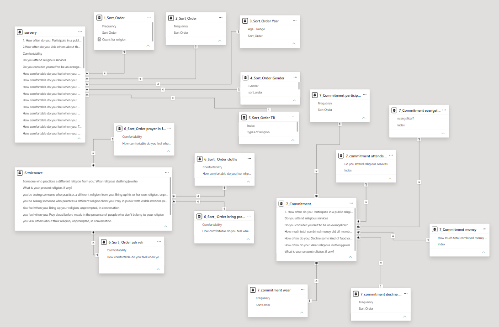
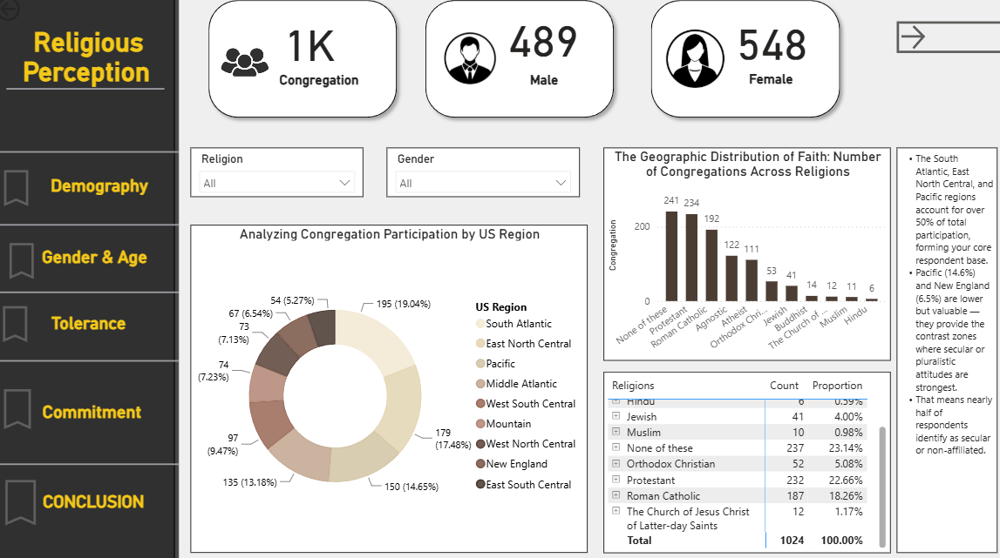
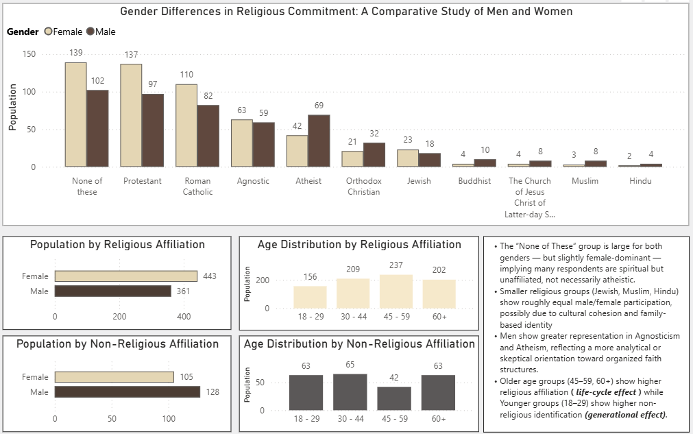
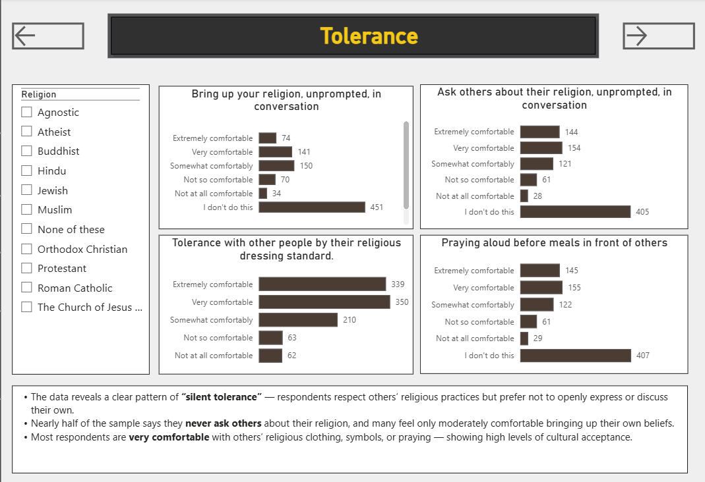
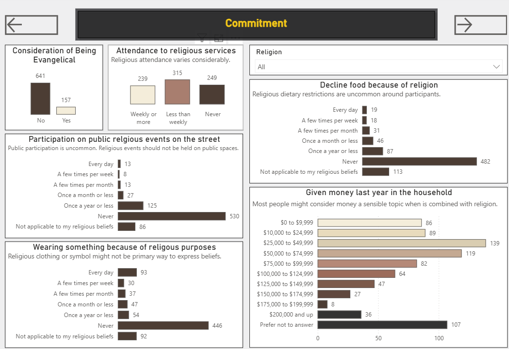
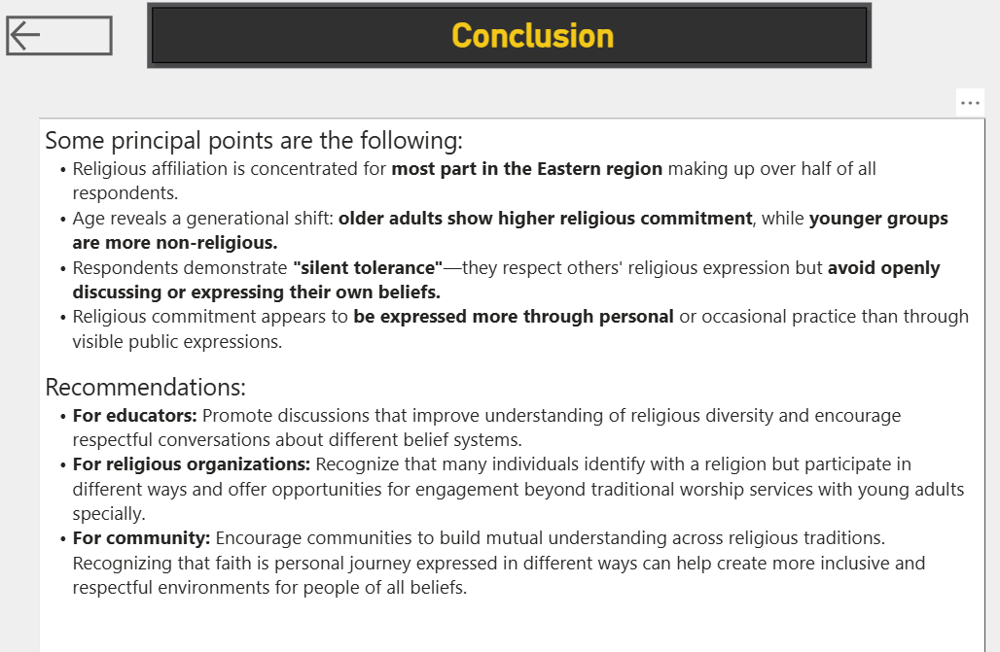

### Problem

Religion became an important part of life that people quite often believe it can influence in somebody's identify. This analysis is to understand how demographic characteristics, religious affiliation, tolerance, and religious commitment interact within a diverse population. 

### Solution

Developed a five-page interactive Power BI dashboard using DAX, data modeling, and survey analytics to transform more than 1,000 survey responses into a intuitive decision tool.

### Outcome

This dashboard enables educators, religious organizations, and community to better understand religious diversity withing a population. By transforming, survey data into actionable insights, the project supports decision-making and encourages initiatives that promote cultural awareness, and respectful engagement across different belief systems.  

### Skills Demostrated

* DAX
* Data Modeling
* Power Query
* Interactive Dashboard Design
* Exploration Data Analysis (EDA)
* Behavioral Analysis
* Demographic Analysis
* Category Comparison and Analysis
* Likert Scale Analysis
* Executive Reporting
* Data driven reporting

### Interactive Dashboard

####  Data Connections and Cleaning

####  Demography

#### Gender & Age

#### Tolerance

#### Commitment

#### Conclusion

