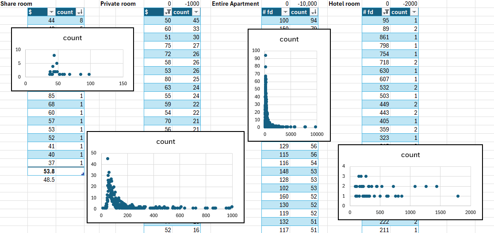

### Data collection

To start with the research, a evaluation of prices of each room type was necessary to clean the data. 

Below, there are some graphs that were made with excel to represent the range of prices by room type:



```{r}
library(DBI)
library(duckdb)
library(DT)

sql <- read.csv("listings.csv")
con <- dbConnect(duckdb()) 

dbWriteTable(con, "listings", sql)
```

### Max and min room type price

```{sql, connection=con, output.var="maxmin"}

SELECT 
    room_type,
    COUNT(*) AS num_properties,
    MAX(CAST(NULLIF(REPLACE(REPLACE(price, '$', ''), ',', ''), '') AS DECIMAL(10,2))) AS max_price,
    MIN(CAST(NULLIF(REPLACE(REPLACE(price, '$', ''), ',', ''), '') AS DECIMAL(10,2))) AS min_price,
    CAST(AVG(CAST(NULLIF(REPLACE(REPLACE(price, '$', ''), ',', ''), '') AS DECIMAL(10,2)))AS DECIMAL(10,2)) AS average_price
FROM listings
WHERE CAST(NULLIF(REPLACE(REPLACE(price, '$', ''), ',', ''), '') AS DECIMAL(10,2))<=10000
GROUP BY room_type
ORDER BY average_price DESC;

```

```{r}
maxmin
```

The highest price from the room types shows to be Hotel rooms. It might make sense since these properties count with several luxury amenities and not the average home property. From this research, the main focus will go to the average renter who is someone that has an apartment or house to rent. Because of that, hotel rooms will be removed in the inspections of this project. 

### Customer Preference and Influence in the market

```{sql, connection=con, output.var="rlistings"}
WITH aggregated_listings AS (
    SELECT 
        neighbourhood_cleansed AS loc_neighborhood,
        COUNT(id) AS num_units,
        CAST(AVG(TRY_CAST(REPLACE(REPLACE(price, '$', ''), ',', '') AS DECIMAL(10,2))) AS DECIMAL(10,2)) AS avg_price,
        AVG(365 - availability_365) AS avg_occupancy,
        CAST(AVG(accommodates) AS DECIMAL(10,0)) AS accommodates,
        CAST(AVG(review_scores_accuracy) AS DECIMAL(10,2)) AS r_accuracy,
        CAST(AVG(review_scores_cleanliness) AS DECIMAL(10,2)) AS r_clean,
        CAST(AVG(review_scores_communication) AS DECIMAL(10,2)) AS r_communication,
        CAST(AVG(review_scores_location) AS DECIMAL(10,2)) AS r_location,
        CAST((CAST(AVG(reviews_per_month) AS DECIMAL(10,2)) * 12) AS DECIMAL(10,2)) AS Yreview_interactions,
    FROM listings 
    WHERE price IS NOT NULL
        AND TRIM(price) != '' -- Filter out empty strings
        AND availability_365 IS NOT NULL
        AND room_type IS NOT NULL 
        -- Safe numeric comparison with TRY_CAST:
        AND TRY_CAST(REPLACE(REPLACE(price, '$', ''), ',', '') AS DECIMAL(10,2)) <= 5000
    GROUP BY neighbourhood_cleansed
)

SELECT 
    loc_neighborhood,
    num_units,
    (avg_price * avg_occupancy) AS total_revenue,
    accommodates,
    r_accuracy,
    r_clean,
    r_communication,
    r_location,
    Yreview_interactions,
CASE
    -- Large established markets
    WHEN num_units >= 100
         AND total_revenue >= 40000
         AND r_location >= 4.85
         AND Yreview_interactions >= 15
    THEN 'Established High-Performing Market'

    -- Small sample but exceptional revenue
    WHEN num_units < 30
         AND total_revenue >= 60000
         AND r_location >= 4.85
    THEN 'Luxury / High Potential'

    -- Solid investment opportunity
    WHEN total_revenue >= 35000
         AND avg_occupancy >= 200
         AND r_location >= 4.80
    THEN 'Growing Opportunity'

    -- High ratings but limited demand
    WHEN r_location >= 4.90
         AND Yreview_interactions < 10
    THEN 'Quality Market - Low Demand'

        ELSE 'Moderate Market'
    END AS market_category
FROM aggregated_listings
WHERE total_revenue>=1000
ORDER BY total_revenue DESC;
```

```{r}
datatable(
  rlistings,
  colnames = c(
    "Neighborhood"          = "loc_neighborhood",
    "Units"                 = "num_units",
    "Est. Total Revenue"    = "total_revenue",
    "Avg Accommodates"      = "accommodates",
    "Accuracy Rating"       = "r_accuracy",
    "Cleanliness Rating"    = "r_clean",
    "Comm. Rating"          = "r_communication",
    "Loc. Rating"       = "r_location",
    "Annual Reviews"        = "Yreview_interactions",
    "Market Category"       = "market_category"
  ),
  options = list(
    pageLength = 10, 
    scrollX = TRUE,
    autoWidth = TRUE,
    # Shrinks font size directly in the rendered DataTable
    initComplete = JS(
      "function(settings, json) {",
      "  $(this.api().table().node()).css({'font-size': '11px'});",
      "  $(this.api().table().header()).css({'font-size': '11px', 'padding': '4px'});",
      "}"
    )
  ),
  rownames = FALSE,
  width = "100%",
  class = "compact stripe hover" # 'compact' tightens cell padding across all rows
) %>%
  formatCurrency(c("Est. Total Revenue"), "$") %>%
  formatRound(c("Accuracy Rating", "Cleanliness Rating", "Comm. Rating", "Loc. Rating"), 2)
```


### Expectative of Next Year Revenue

```{sql, connection=con, output.var="revenue"}
SELECT
    room_type,
    num_properties,
    occupancy,
    CAST(last_year_revenue / occupancy AS DECIMAL(10,2)) AS efficient_occupancy,
    avg_price_night,
    est_year_revenue,
    last_year_revenue,
    est_year_revenue - last_year_revenue AS revenue_gap,
    CAST(((est_year_revenue - last_year_revenue) / last_year_revenue) * 100 AS DECIMAL(10,2)) AS expected_growth_percentage,
    CAST((volatility / est_year_revenue) AS DECIMAL(10,2)) AS coeficient_var,
    CAST(est_year_revenue / CAST((volatility / est_year_revenue) AS DECIMAL(10,2)) AS DECIMAL(10,2)) AS risk_adjusted_return
FROM (
    SELECT
        room_type,
        COUNT(*) AS num_properties,
        CAST(AVG(365 - availability_365) AS INTEGER) AS occupancy,
        CAST(AVG(CAST(NULLIF(REPLACE(REPLACE(price, '$', ''), ',', ''), '') AS DECIMAL(10,2))) AS DECIMAL(10,2)) AS avg_price_night,
        CAST(AVG(CAST(NULLIF(REPLACE(REPLACE(price, '$', ''), ',', ''), '') AS DECIMAL(10,2))) * AVG(365 - availability_365) AS DECIMAL(10,2)) AS est_year_revenue,
        CAST(AVG(estimated_revenue_l365d) AS DECIMAL(10,2)) AS last_year_revenue,
        CAST(STDDEV(estimated_revenue_l365d) AS DECIMAL(12,2)) AS volatility,
        (CAST(STDDEV(estimated_revenue_l365d) AS DECIMAL(12,2)) / NULLIF(CAST(AVG(estimated_revenue_l365d) AS DECIMAL(12,2)), 0)) AS coeficient_var
    FROM listings
    WHERE price IS NOT NULL
        AND availability_365 IS NOT NULL
        AND estimated_revenue_l365d IS NOT NULL
        AND room_type <> 'Hotel room'
        AND TRY_CAST(NULLIF(REPLACE(REPLACE(price, '$', ''), ',', ''), '') AS DECIMAL(10,2)) <= 10000
    GROUP BY room_type
) AS summary
ORDER BY est_year_revenue DESC;
```

```{r}
datatable(revenue)
```


