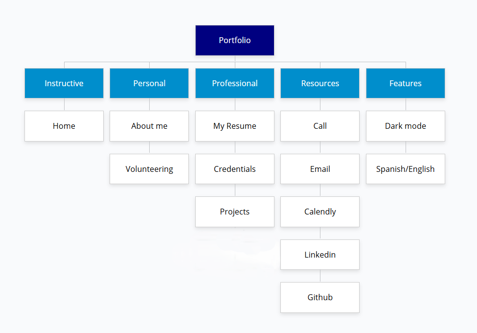
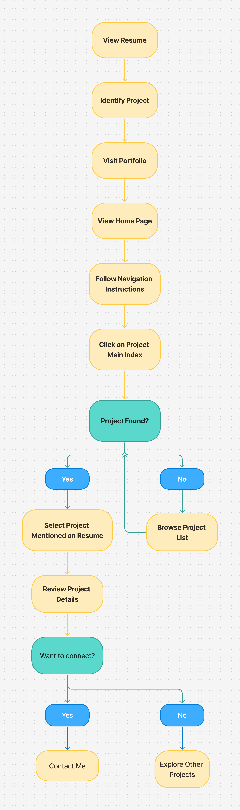
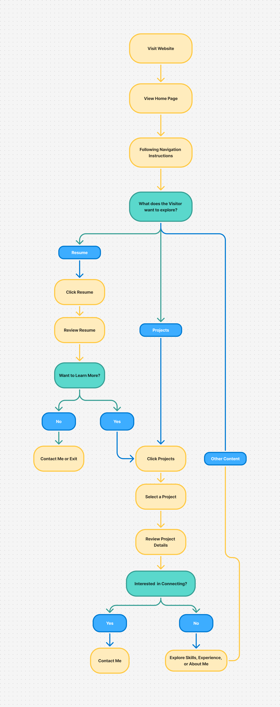
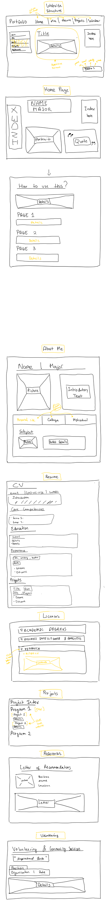
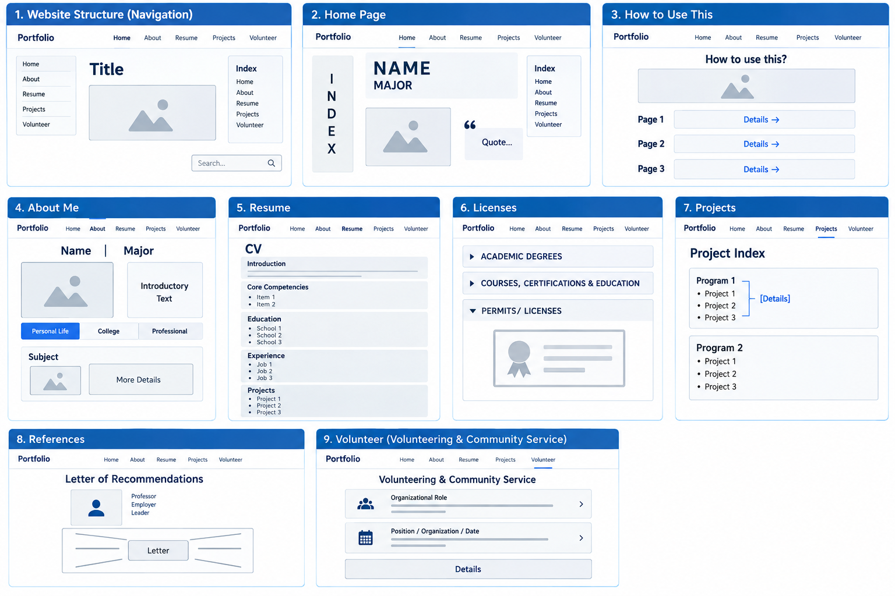
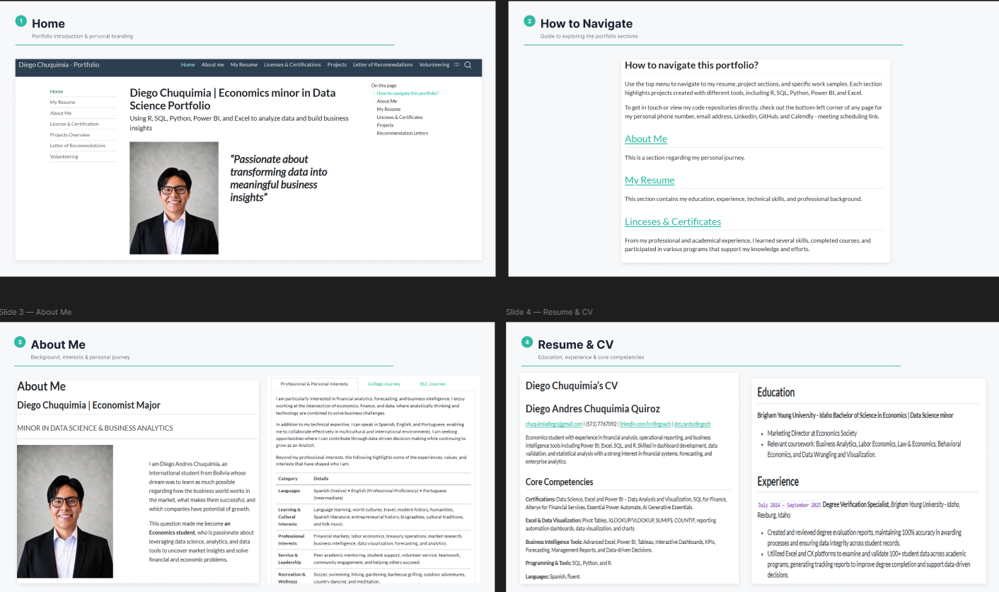
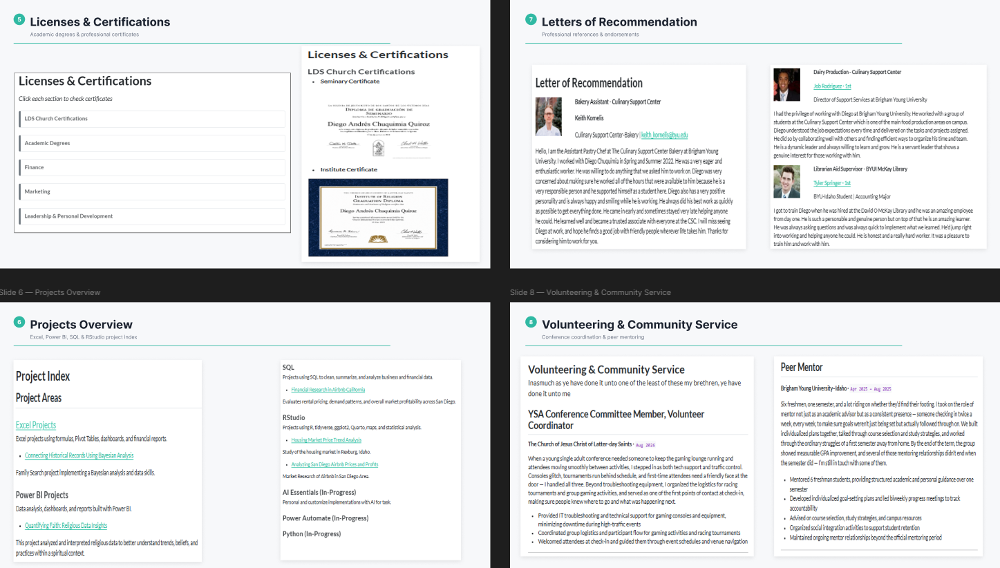
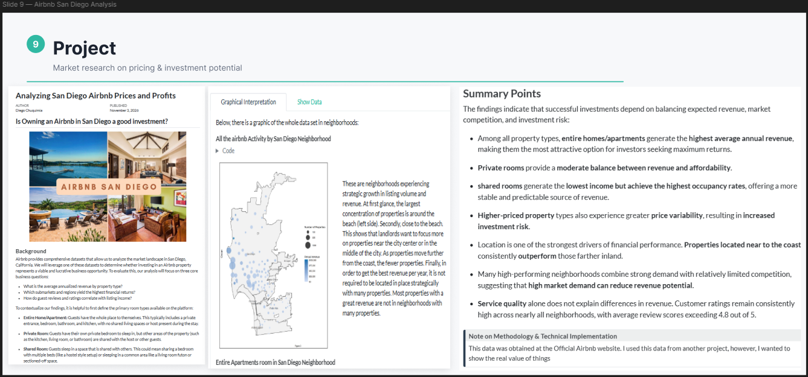

##  Background

Creating a personal website is one of the best ways to reach out to more potential hiring managers. This new website was an opportunity to apply the UX design tool such as Figma and Microsoft One Note. 

##  Architecture & Strategy

### Sitemap

For constructing this website, it is important to have an instruction section for efficient purposes, some personal aspects to connect with the audience, a professional section to inform skills & achievements, a resource section for contacting purposes, and finally some features tools to make the website more adaptable to a different audience. 

### User Flows

There are two main user flows which follow these next patterns:

::::: {#layout-container .columns}

::: {.column width="50%" style="vertical-align: middle;"}

:::

::: {.column style="vertical-align: middle; padding-left: 5%;" width="45%"}

The first impression from reviewing my resume and cover letter will bring some heads up regarding my personal website. This will be the main interaction that users will have with the website and the oportunity to connect with the main user.

:::

:::::

::::: {#layout-container .columns}

::: {.column width="50%" style="vertical-align: middle;"}

:::

::: {.column style="vertical-align: middle; padding-left: 5%;" width="45%"}

The next case is that I contact recruiters directly and offered them my portfolio website intermediately so they can see my work and personal information.

:::

:::::

##  Website Design

::: panel-tabset

### Wireframe

This the whoel process developed by Microsoft One Note.

### Mockups

I used AI for developing a cleaning version of the wireframe idea.

:::

## Interactive Experience

##  Results & Takeaways

Although creating a clean version of the website was focused on the desing, the main struggle was to adapt the coding in R with the favorite design.  

